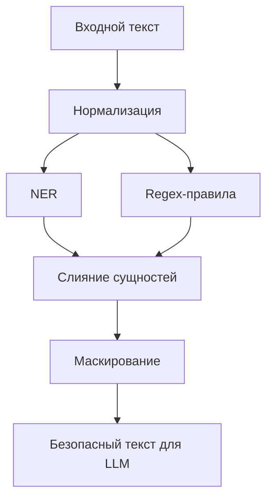

# Пайплайн защиты чувствительных данных перед LLM

## Кратко
Пайплайн предобработки русскоязычного текста перед LLM: извлечение сущностей, нормализация и маскирование чувствительных данных до передачи текста в модель.

## Задача
Снизить риск утечки персональных и чувствительных данных при работе с LLM за счёт отдельного слоя обработки текста до генеративной модели.

## Что улучшено
- hybrid-подход `NER + regex + нормализация` расширяет покрытие по сравнению с `NER-only`;
- нормализация входа уменьшает число пропусков и ложных срабатываний;
- отдельный privacy layer делает обработку более контролируемой и проверяемой.

## Архитектура


## Метрики и результаты
| Режим | Precision | Recall | F1 | Покрытие типов сущностей |
|---|---:|---:|---:|---:|
| regex-only | TBD | TBD | TBD | TBD |
| NER-only | TBD | TBD | TBD | TBD |
| hybrid: NER + regex + нормализация | TBD | TBD | TBD | TBD |

Дополнительно показать разрез по типам сущностей: ФИО, телефоны, e-mail, адреса, номера документов и другие чувствительные идентификаторы.

## Структура репозитория
- основной код пайплайна — в ноутбуках и/или python-модулях;
- правила и словари — в конфигурационных файлах;
- примеры входов/выходов — в examples или прямо в README.

## Запуск
```bash
python -m venv .venv
source .venv/bin/activate
pip install -r requirements.txt
python main.py  # либо актуальная точка входа из репозитория
```

## Ограничения
- качество зависит от полноты правил и специфики домена;
- без полноценной разметки трудно надёжно измерить recall;
- некоторые сущности требуют доменно-специфических словарей и постобработки.

## Направления развития
- добавить конфигурируемые правила по доменам;
- расширить набор сущностей и формат маскирования;
- сделать пакетную обработку и API-слой;
- добавить ручную валидацию качества на размеченной выборке.
